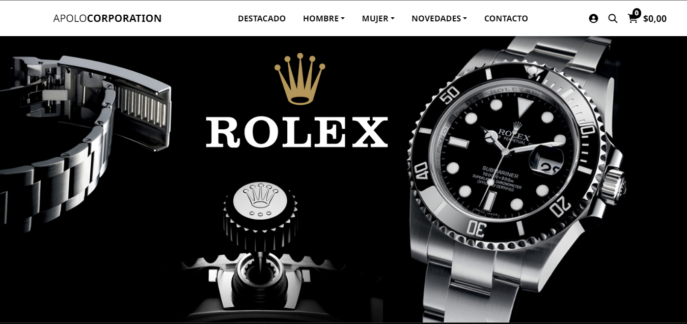

# Tienda de Relojes

Este proyecto es una tienda de relojes en línea que he desarrollado como parte de mi aprendizaje en diseño web y práctica de JavaScript. Fue mi primer proyecto significativos en los que me he enfocado en el manejo de JavaScript, ya que estaba en las primeras etapas de aprender este lenguaje de programación.

## Características a futuro para implementar
  
- **Filtrado y Búsqueda:** Para que los usuarios puedan filtrar los relojes por precio, marca, estilo, y más, facilitando la búsqueda del reloj perfecto.

- **Carrito de Compras:** Los usuarios podran agregar y eliminar productos del carrito de compras, así como ajustar las cantidades y ver el total de su compra.

- **Proceso de Pago:** Se simulara un proceso de pago básico para que los usuarios puedan experimentar cómo sería comprar un reloj en la tienda.

## Tecnologías utilizadas

- **HTML y CSS:** Se utilizó HTML y CSS para el diseño y la estructura visual de la página web, asegurándose de que la tienda tenga una apariencia atractiva y profesional.

- **JavaScript:** La funcionalidad principal de la tienda, como un fetching de datos local y eventos de mouse

